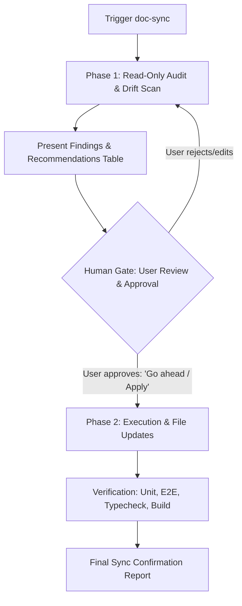

# Documentation Sync & Drift Reconciler (doc-sync)

## Purpose

Maintain strict synchronization between code implementation and living documentation across the workspace while enforcing the **workspace-wide Human-in-the-Loop gatekeeping protocol**:
1. Feature specs and research graduation (`research/` $\rightarrow$ `docs/specs/` or `docs/product/`)
2. Master Capability Indices (`staging` and `main`)
3. Root code changelog (`CHANGELOG.md`)
4. Submodule documentation changelog (`docs/CHANGELOG.md`)
5. Architecture guides, READMEs, and `AGENTS.md` instructions
6. Handover files (`where-we-left-off.md`)
7. Universal version tags and badge parity
8. Git submodule pointer state

---

## Operating Protocol: Proposal-First (Two-Phase Execution)

In accordance with workspace rules in `AGENTS.md` ("*Gatekeep implementation — no executions or file writing until explicit user go-ahead*"), `doc-sync` operates in two distinct phases:



### Phase 1: Read-Only Audit & Proposal
1. Scan git diff, commit history, routes, and `research/` / `.local/` directories.
2. Identify all drifted areas across the 8 checklist points.
3. Formulate specific recommendations (e.g. proposed graduation paths, draft changelog bullet points, updated capability index domain tables).
4. **STOP and present the findings to the user**. The user has the final say on which files to graduate, how changelog entries are phrased, and which documents to touch.

### Phase 2: Execution (Only After Explicit Approval)
1. Write/update approved documentation files.
2. Run test suites (`npm test`, `npx tsc --noEmit`, `npx playwright test`) and build check (`npm run build`).
3. Output the final summary report with file links.

---

## 8-Point Reconciliation Checklist

### 1. Research & Spec Graduation
- **Inspect**: Check `research/`, `references/`, and `.local/` for plans, algorithms, or specs whose code has been implemented and verified.
- **Proposal Standard**:
  - State the source file and what has been built.
  - Recommend target destination (e.g. `docs/specs/<feature-name>.md` or `docs/product/<domain>.md`).
  - Explain whether the source file should be archived, deleted, or kept local.
- **Rule**: Never graduate or delete research/local plan files without explicit user sign-off.

### 2. Master Capability Index Sync
- **Inspect**: Compare current `HEAD` commit and git diff against `docs/specs/capability-index/master-index-staging.md` (and `master-index-main.md` if main changed).
- **Proposal Standard**:
  - List new or modified domains, files, confidence ratings, and test metrics.
  - Highlight any new routes added to `web/` or modules added to `src/`.

### 3. Root Repo Code Changelog (`CHANGELOG.md`)
- **Inspect**: Review commits/changes since the last version release.
- **Proposal Standard**:
  - Present drafted entries under `## [Unreleased]` categorized by `### Added`, `### Changed`, and `### Fixed`.
  - Ensure copy adheres to Bahasa Indonesia / English standards appropriate for the project changelog.

### 4. Docs Repo Changelog (`docs/CHANGELOG.md`)
- **Inspect**: Check if files inside the `docs/` (`selangkah-docs`) submodule were added, moved, or updated.
- **Proposal Standard**: Present drafted log entries for new specs, capability index updates, or architecture docs.

### 5. README & AGENTS.md Integrity
- **Inspect**: Check route lists, directory trees, and environment configurations in:
  - Root `README.md` and `.local/AGENTS.md` (and workspace root `AGENTS.md`)
  - Docs repo `docs/README.md` and `docs/AGENTS.md`
- **Proposal Standard**: Flag stale paths, outdated folder trees, or obsolete CLI instructions.

### 6. Handover Protocol Alignment (`where-we-left-off.md`)
- **Inspect**: Review the current active agent session and `### Next up` list.
- **Proposal Standard**:
  - Draft updates for the active agent's section (e.g. `## 2. Gemini Session`).
  - **Rule**: NEVER overwrite another agent's session section.
  - **Rule**: NEVER replace or overwrite existing items in `### Next up`; always preserve and append new items.

### 7. Universal Version Badge Sweep
- **Inspect**: Check version consistency across all 4 surfaces:
  1. `package.json` (`"version": "x.y.z"`)
  2. `CHANGELOG.md` (`## [x.y.z]`)
  3. `<meta name="version" content="x.y.z">` on every HTML page
  4. Visible footer version badges (`<span ...>vx.y.z</span>`)
- **Proposal Standard**: Report any version drift or mismatch.

### 8. Git Submodule Pointer Integrity
- **Inspect**: Check git status of `docs/` submodule:
  ```bash
  cd docs && git status -s && cd ..
  git status -s docs
  ```
- **Proposal Standard**: Advise if `docs/` needs a commit first before updating the parent repository submodule pointer.

---

## Output Standards

### Phase 1 Output Template (Audit & Proposal)

```markdown
## 🔍 Documentation Drift Audit & Proposal

### 1. Research & Spec Graduation
- **Candidate 1**: `.local/my-feature-plan.md` $\rightarrow$ Recommend graduating to `docs/specs/my-feature.md`
- *Decision needed: Approve graduation and target path?*

### 2. Capability Index Drift
- **Domains affected**: [e.g. Open Graph Social Share Pipeline]
- **Indexed HEAD update**: `abc1234` $\rightarrow$ `def5678`
- **Test baseline update**: 136 unit / 76 E2E

### 3. Proposed Code Changelog (`CHANGELOG.md`)
- `### Added`: ...
- `### Changed`: ...
- `### Fixed`: ...

### 4. Proposed Docs Changelog (`docs/CHANGELOG.md`)
- Added `docs/specs/my-feature.md`

### 5. README & AGENTS.md Parity
- No drift detected / [List proposed adjustments]

### 6. Handover Status (`where-we-left-off.md`)
- Session summary drafted; appended 2 items to `Next up`.

### 7. Universal Version Parity
- Verified all 16 pages match `v0.0.6b`.

### 8. Submodule Pointer Status
- `docs/` submodule working tree status: [Clean / Modified]

---
> **Awaiting your confirmation**: Please review the proposals above. Reply "Approve" or specify any edits to proceed with execution.
```

### Phase 2 Output Template (After User Approval)

```markdown
### ✅ Documentation Sync Execution Report — YYYY-MM-DD

| Check Area | Action Taken | Target Files |
|---|:---:|---|
| **1. Research Graduation** | Graduated | `docs/specs/my-feature.md` |
| **2. Capability Index** | Updated | `docs/specs/capability-index/master-index-staging.md` |
| **3. Code Changelog** | Updated | `CHANGELOG.md` (`[Unreleased]`) |
| **4. Docs Changelog** | Updated | `docs/CHANGELOG.md` |
| **5. README & AGENTS.md** | Verified | `.local/AGENTS.md`, `README.md` |
| **6. Handover File** | Updated | `.local/where-we-left-off.md` |
| **7. Version Parity** | Verified | Verified `v0.0.6b` across all pages |
| **8. Submodule Pointer** | Synced | `docs/` submodule commit recorded |

**Verification**: All unit tests (`npm test`) and E2E tests (`npx playwright test`) confirmed passing.
```
